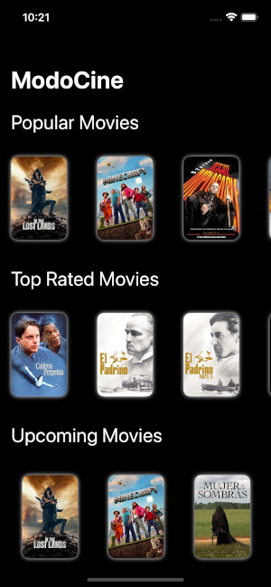

# ModoCine

ModoCine is a sleek and modern iOS Movie App built with SwiftUI and Clean Architecture. Browse upcoming, popular and top rated movies, check out details, view cast & similar films — all powered by The Movie DB API.

## Project Structure

This project follows the Clean Architecture principles to separate concerns and keep scalability

- SwiftUI for declarative and reactive UI
- URLSession + async/await for making network requests
- The Movie DB API for fetching movies data
- MVVM + Clean Architecture for scalability and testability
- XCTest for unit testing
- @Published + ObservableObject for reactive ViewModel
    
## Screenshots

## Get it on App Store

# Support

Like what you see?

 - ⭐ **Star This repo!** — it helps more people discover it!
 - 👍🏽 **Follow me** 

Thanks for your support! 🫶🏽
